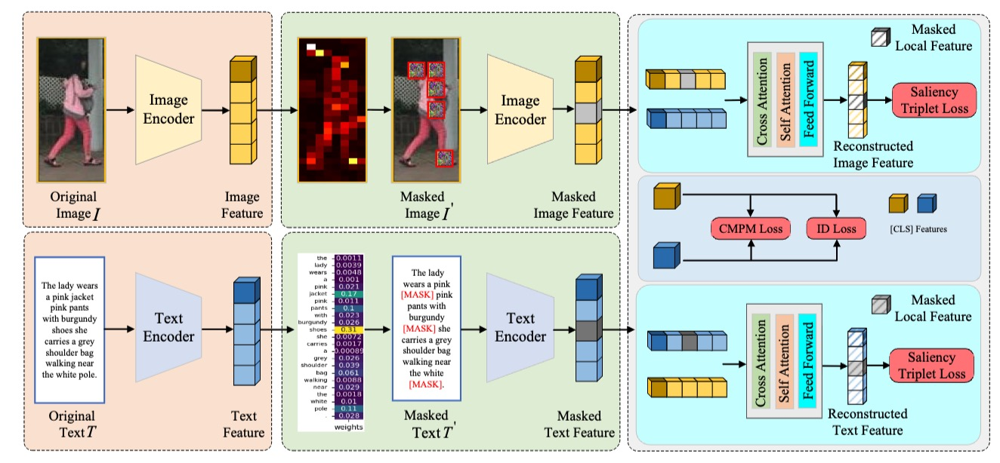

# Text-Based Person Search via Fine-Grained Cross-Modal Semantic Alignment （FCSA）


## Highlights

 Existing text-based person search methods struggle with complex cross-modal interactions, failing to capture subtle semantic nuances. To address this, we propose a novel Fine-grained Cross-modal Semantic Alignment (FCSA) framework that enhances accuracy and robustness in text-based person search. FCSA introduces two key components: the Cross-Modal Reconstruction Strategy (CMRS) and the Saliency-Guided Masking Mechanism (SGMM). CMRS facilitates feature alignment by leveraging incomplete visual and textual features, promoting bidirectional reasoning across modalities, and enhancing fine-grained semantic understanding. SGMM further refines performance by dynamically focusing on salient visual patches and critical text tokens, thereby improving discriminative region perception and image-text matching precision. Our approach outperforms existing state-of-the-art methods, achieving mean Average Precision (mAP) scores of 69.72\%, 43.78\% and 48.48\% on CUHK-PEDES, ICFG-PEDES, and RSTPReid, respectively. 



## Usage
### Requirements
we use single RTX4090 24G GPU for training and evaluation. 
```
pytorch 1.9.0
torchvision 0.10.0
prettytable
easydict
```

### Prepare Datasets
Download the CUHK-PEDES dataset from [here](https://github.com/ShuangLI59/Person-Search-with-Natural-Language-Description), ICFG-PEDES dataset from [here](https://github.com/zifyloo/SSAN) and RSTPReid dataset form [here](https://github.com/NjtechCVLab/RSTPReid-Dataset)

Organize them in `your dataset root dir` folder as follows:
```
|-- your dataset root dir/
|   |-- <CUHK-PEDES>/
|       |-- imgs
|            |-- cam_a
|            |-- cam_b
|            |-- ...
|       |-- reid_raw.json
|
|   |-- <ICFG-PEDES>/
|       |-- imgs
|            |-- test
|            |-- train 
|       |-- ICFG_PEDES.json
|
|   |-- <RSTPReid>/
|       |-- imgs
|       |-- data_captions.json
```


## Training

```python
python train.py \
--name iira \
--img_aug \
--batch_size 64 \
--MLM \
--dataset_name $DATASET_NAME \
--loss_names 'id+cmpm+stl_img+stl_txt' \
--num_epoch 60
```

## Testing

```python
python test.py --config_file 'path/to/model_dir/configs.yaml'
```

[Model & log for CUHK-PEDES](https://pan.baidu.com/s/1GKS_uqU5_cYmJqqwR1P_2A?pwd=segp) Extraction code segp


## Acknowledgments
Some components of this code implementation are adopted from [CLIP](https://github.com/openai/CLIP), and [IRRA](https://github.com/anosorae/IRRA). We sincerely appreciate for their contributions.


